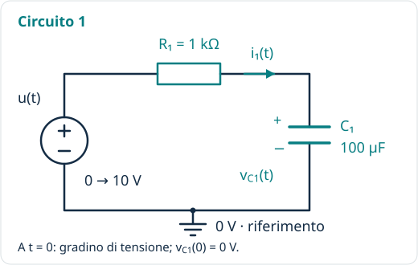
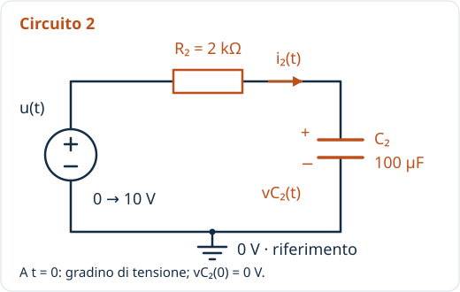
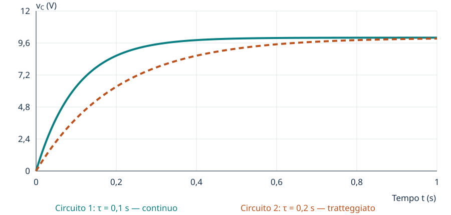

---
title: "Due circuiti RC a confronto"
description: "Esplora costante di tempo, carica del condensatore e ruolo delle scale."
---

[← Indice del laboratorio](index.qmd)

La carica di un condensatore collega una formula a un fenomeno osservabile:
**R e C determinano la rapidità della risposta; la tensione finale resta 10 V.**

## Gli schemi elettrici

Confrontiamo **due circuiti indipendenti**, ciascuno formato da un generatore ideale di tensione, un resistore e un condensatore in serie. A $t=0$ la tensione del generatore $u(t)$ passa da 0 a 10 V e poi resta costante; entrambi i condensatori sono inizialmente scarichi.

:::: {.rc-schematics}

{#fig-circuito-rc-1}

{#fig-circuito-rc-2}

::::

- $i_1(t)$ e $i_2(t)$ sono le correnti di carica, positive nel verso delle frecce.
- $v_{C1}(t)$ e $v_{C2}(t)$ sono le tensioni rappresentate nel grafico, **ai capi dei condensatori**.
- Il nodo a **0 V** è il riferimento di tensione e il ritorno al generatore; il simbolo non rappresenta la terra di protezione.
- Qui sono mostrati i valori iniziali. Nell'app i valori sugli schemi cambiano insieme agli slider.

## Il modello

Consideriamo due circuiti RC ideali, condensatori inizialmente scarichi e
un gradino di alimentazione di 10 V applicato a $t=0$:

$$
v_C(t)=10\left(1-e^{-t/\tau}\right), \qquad \tau=RC,\qquad t\geq0.
$$

Nel calcolo R si esprime in ohm e C in farad.
Con i controlli in kΩ e µF, $\tau[\mathrm{s}]=0{,}001\,R[\mathrm{k\Omega}]\,C[\mathrm{\mu F}]$.

## Prova il laboratorio

::: {.content-visible when-format="html"}
[Apri il laboratorio in una pagina dedicata](rc/index.html){.btn .btn-primary}

<a href="rc/index.html" download="laboratorio-rc.html">Scarica l'HTML autonomo per usarlo offline</a>

<iframe src="rc/index.html" title="Laboratorio interattivo: confronto di due cariche RC" style="width:100%;height:900px;border:1px solid #dbe1e4;border-radius:12px;" loading="lazy" allow="fullscreen" allowfullscreen></iframe>
:::

::: {.content-visible when-format="pdf"}
{#fig-rc}

Il laboratorio interattivo è disponibile nella versione web di questa pagina.
:::

I controlli sono sotto il grafico: puoi inserire un valore, scegliere il **passo** e usare le frecce ▲ / ▼. Il passo del tempo è espresso in secondi; il suo slider conserva la scala logaritmica. Il pulsante **Schermo intero** amplia il laboratorio senza cambiare i valori. Gli schemi restano disponibili sotto lo spazio di lavoro e nella sezione iniziale della pagina.

### Configurazione di partenza

| Parametro | Circuito 1 | Circuito 2 |
|---|---:|---:|
| R | 1 kΩ | 2 kΩ |
| C | 100 µF | 100 µF |
| τ | 0,1 s | 0,2 s |
| $v_C$ a t = 0,1 s | 6,321 V | 3,935 V |

La figura statica e il [preset dei parametri](../assets/rc/preset.json) documentano
questa configurazione. **Gli assi non cambiano quando modifichi R o C.**
Puoi regolarli deliberatamente con i due controlli dedicati.

## Prima prevedi, poi verifica

### 1. Raddoppiare la resistenza

Mantieni le impostazioni iniziali. Quale curva sarà più lenta? Cambierà la
tensione finale? Misura entrambe le tensioni a 0,1 s e spiega il risultato
usando la costante di tempo.

### 2. Componenti diversi, stessa risposta

Lascia R₁ = 1 kΩ e C₁ = 100 µF. Cerca una coppia diversa R₂/C₂ che faccia
coincidere le curve. Prova poi R₂ = 2 kΩ e C₂ = 50 µF.
Puoi ricavare separatamente R e C osservando soltanto la tensione?

### 3. Misurare τ

Seleziona l'istante in cui il circuito 1 raggiunge circa 6,32 V.
Confrontalo con τ₁ e ripeti per il circuito 2. Una finestra temporale molto
ampia facilita o rende più difficile la misura?

### 4. Una carica «quasi completa»

Confronta la tensione a τ, 3τ e 5τ. A 5τ il condensatore raggiunge circa
9,933 V, senza raggiungere esattamente 10 V in un tempo finito nel modello.
Come sceglieresti una soglia pratica di carica completa?
Approfondimento: il 90% si raggiunge a circa 2,303τ.

### 5. Il ruolo della scala

Mantieni R e C costanti e cambia soltanto gli assi.
Poi fissa gli assi e cambia R. Distingui una modifica della visualizzazione
da una modifica del circuito.

## Consegna

Per ciascun esperimento annota sul quaderno o in OneNote:
**parametri, previsione, due o tre misure e una conclusione motivata**.
Usa le unità di misura e collega ogni osservazione alla formula.

## Limiti del modello

Non sono rappresentati tolleranze, dispersioni, parassiti o variazioni dei
componenti durante il transitorio. L'animazione percorre la finestra visibile
in sei secondi reali: il tempo fisico è quello indicato dal grafico.
