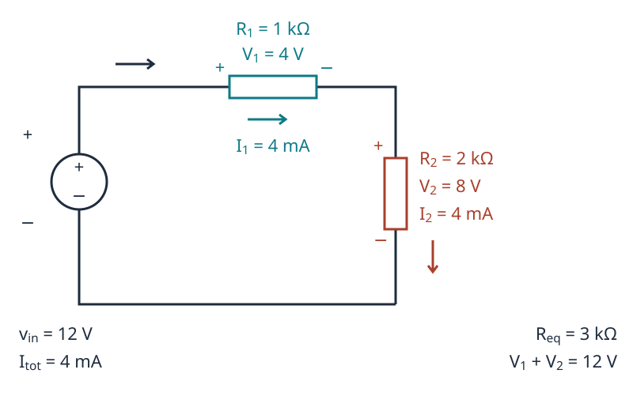
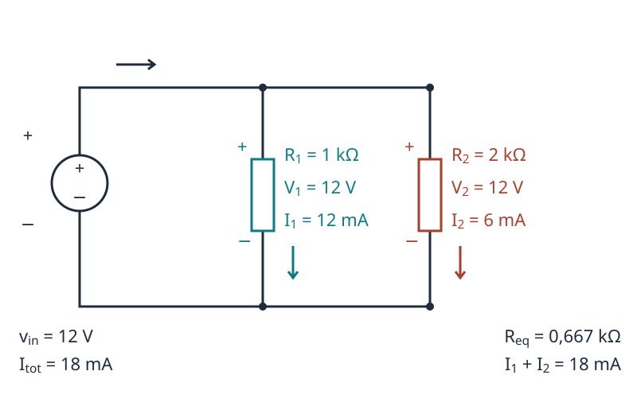

[← Indice del laboratorio](index.qmd)

Modifica le resistenze e osserva sullo schema tutte le tensioni e le correnti. Scegli **Serie**, **Parallelo** oppure **Confronto**; con **Schermo intero** puoi dedicare più spazio ai circuiti.

::: {.content-visible when-format="html"}

:::

## Che cosa condividono i resistori?

- **In serie, i resistori condividono la stessa corrente che li attraversa:** $I_1=I_2=I_{tot}$. La tensione di ingresso si ripartisce: $v_{in}=V_1+V_2$.
- **In parallelo, i resistori condividono la stessa tensione ai capi:** $V_1=V_2=v_{in}$. La corrente totale si ripartisce: $I_{tot}=I_1+I_2$.

Queste proprietà valgono con entrambi i tipi di generatore. Nei disegni sono indicate le polarità delle tensioni e i versi delle correnti; ogni resistore è attraversato dalla corrente dal polo positivo al negativo.

## Il generatore e il modello

Il **generatore ideale di tensione** mantiene il valore impostato di $v_{in}$ e fornisce la corrente richiesta dal circuito. Il **generatore ideale di corrente** mantiene il valore impostato di $I_{tot}$ e sviluppa la tensione richiesta dal circuito. Nella vista Confronto, il tipo di generatore, il valore imposto e le resistenze sono uguali nelle due viste; la grandezza non imposta può essere diversa.

| Collegamento | Resistenza equivalente | Relazioni dei resistori |
|---|---|---|
| Serie | $R_{eq}=R_1+R_2$ | $V_1=I_{tot}R_1$, $V_2=I_{tot}R_2$ |
| Parallelo | $R_{eq}=\dfrac{R_1R_2}{R_1+R_2}$ | $I_1=v_{in}/R_1$, $I_2=v_{in}/R_2$ |

Per il generatore di tensione si calcola $I_{tot}=v_{in}/R_{eq}$; per quello di corrente si calcola $v_{in}=I_{tot}R_{eq}$. I controlli usano V, mA e kΩ: $1\,\mathrm{mA}\cdot1\,\mathrm{k\Omega}=1\,\mathrm{V}$. Le letture sono arrotondate, mentre i calcoli conservano la precisione numerica.

Il modello considera resistori ideali, resistenze strettamente positive e regime continuo. Le tensioni calcolate con il generatore ideale di corrente non rappresentano i limiti di un generatore reale.

### Configurazione iniziale

$v_{in}=12$ V, $R_1=1$ kΩ, $R_2=2$ kΩ.

## Prima prevedi, poi verifica

1. **Serie, tensione imposta:** aumenta $R_2$ mantenendo $R_1$ costante. Che cosa accade alla corrente comune e a $V_2$?
2. **Parallelo, tensione imposta:** aumenta $R_2$. Cambiano $V_1$, $V_2$ e $I_1$? Quale corrente cambia?
3. **Serie, corrente imposta:** aumenta $R_2$. Osserva che $V_1$ resta invariata, mentre aumentano $V_2$ e $v_{in}$.
4. **Parallelo, corrente imposta:** aumenta $R_2$. Verifica che la tensione comune cambia e che si redistribuisce la corrente tra i due rami.
5. **Resistenze uguali:** imposta $R_1=R_2$. In quale collegamento si divide a metà la tensione? In quale si divide a metà la corrente totale?

[Ripassa Ohm, Kirchhoff, serie e parallelo](../risorse/fondamenti/leggi-dei-circuiti.qmd) · [Il resistore](../risorse/componenti/resistore.qmd)
