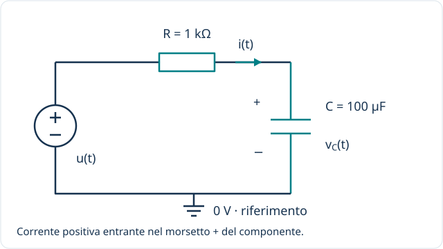

[← Componenti](index.qmd) · [Resistore](resistore.qmd) · [Induttore →](induttore.qmd)

**Idea guida:** il condensatore immagazzina energia nel campo elettrico. La corrente trasferisce carica e fa variare la tensione; una tensione non nulla può restare presente anche senza corrente.

## Livello 1 / Riconoscere il componente {#livello-1}

La **capacità** $C$ si misura in farad ($\mathrm F$). Useremo $C=100\,\mathrm{\mu F}=10^{-4}\,\mathrm F$. Il circuito di riferimento comprende anche $R=1\,\mathrm{k\Omega}$, che limita la corrente di carica.

La stessa corrente $i(t)$ attraversa R e C. Le tensioni si sommano: $u(t)=v_R(t)+v_C(t)$. Il circuito rimane lo stesso nei diversi livelli; cambieremo il segnale del generatore.

## Livello 2 / Regime continuo e singolo istante {#livello-2}

### Carica, tensione ed energia

Nel modello lineare:

$$q(t)=Cv_C(t),\qquad W_C(t)=\frac12 Cv_C^2(t).$$

$q$ è la carica della piastra di riferimento positiva; l'altra porta carica opposta. Con $v_C=5\,\mathrm V$:

$$q=500\,\mathrm{\mu C},\qquad W_C=1{,}25\,\mathrm{mJ}.$$

### A regime continuo

Quando la tensione è costante, la carica non cambia e la corrente è nulla. Il condensatore ideale si comporta come un **circuito aperto a regime continuo**. Nel circuito disegnato, con $u=10\,\mathrm V$ costante da tempo sufficiente, $v_C$ tende a $10\,\mathrm V$ e $i$ a zero.

Questo non descrive l'intera carica: subito dopo una variazione del generatore può circolare corrente.

### La fotografia di un istante

Nel circuito RC, conoscendo sia $u(t_0)$ sia $v_C(t_0)$:

$$i(t_0)=\frac{u(t_0)-v_C(t_0)}{R}.$$

Se $u=10\,\mathrm V$ e $v_C=4\,\mathrm V$, la corrente vale $6\,\mathrm{mA}$. **La sola tensione sul condensatore non determina la corrente:** in questo calcolo usiamo anche il generatore e il resistore.

## Livello 3 / Dalle variazioni alla derivata {#livello-3}

### Prima un intervallo, poi un istante

La corrente media è carica trasferita divisa per tempo:

$$i_{\mathrm{media}}=\frac{\Delta q}{\Delta t}=C\frac{\Delta v_C}{\Delta t}.$$

Facendo tendere l'intervallo a zero si ottiene:

$$\boxed{i_C(t)=C\frac{dv_C(t)}{dt}}.$$

La derivata è la pendenza della tensione: se $v_C$ cresce, la corrente è positiva; se diminuisce, è negativa. Con $C=100\,\mathrm{\mu F}$, una crescita di $1\,\mathrm V$ in $10\,\mathrm{ms}$ richiede una corrente media di $10\,\mathrm{mA}$; se la crescita è lineare, questa è anche la corrente istantanea nell'intervallo.

La forma integrale rende visibile la memoria:

$$v_C(t)=v_C(t_0)+\frac1C\int_{t_0}^{t}i_C(\xi)\,d\xi.$$

Con corrente finita, la tensione non può saltare istantaneamente: $v_C(0^+)=v_C(0^-)$. Un salto ideale richiederebbe un impulso di corrente, escluso dal modello RC qui considerato con alimentazione finita.

### Il circuito RC: derivare l'equazione

Sostituiamo $v_R=Ri$ e $i=C\,dv_C/dt$ in $u=v_R+v_C$:

$$RC\frac{dv_C}{dt}+v_C=u(t).$$

Per $u(t)=U_0$ a partire da $t=0$ e tensione iniziale $V_0$:

$$v_C(t)=U_0+(V_0-U_0)e^{-t/\tau},\qquad \tau=RC.$$

La tensione va dal valore iniziale $V_0$ al valore finale $U_0$. Dopo una costante di tempo ha compiuto circa il $63{,}2\%$ della variazione complessiva.

Con $U_0=10\,\mathrm V$, $V_0=0$, $R=1\,\mathrm{k\Omega}$ e $C=100\,\mathrm{\mu F}$:

$$\tau=0{,}1\,\mathrm s,\quad v_C(\tau)\simeq6{,}321\,\mathrm V,\quad i(\tau)\simeq3{,}679\,\mathrm{mA}.$$

[Verifica il risultato nell'app RC](../../laboratori/rc.qmd).

## Livello 4 / Regime sinusoidale e fasori {#livello-4}

Se la tensione **sul condensatore** è $v_C(t)=V_m\cos(\omega t)$, derivando:

$$i_C(t)=-\omega CV_m\sin(\omega t)=\omega CV_m\cos(\omega t+\pi/2).$$

La corrente anticipa la tensione di $90^\circ$. Con la convenzione dei fasori basata su $e^{j\omega t}$:

$$\underline I_C=j\omega C\underline V_C,\qquad Z_C(j\omega)=\frac{1}{j\omega C}\quad(\omega>0).$$

All'aumentare della frequenza il modulo $|Z_C|=1/(\omega C)$ diminuisce. Con $C=100\,\mathrm{\mu F}$ e $f=50\,\mathrm{Hz}$, $|Z_C|\simeq31{,}83\,\Omega$. Una tensione sul condensatore di picco $1\,\mathrm V$ corrisponde a una corrente di picco circa $31{,}42\,\mathrm{mA}$.

**Attenzione alla grandezza assegnata:** $v_C$ non coincide in generale con la tensione $u$ del generatore nello schema RC. Per ricavarla si considera anche R:

$$\frac{\underline V_C}{\underline U}=\frac{Z_C}{R+Z_C}=\frac{1}{1+j\omega RC}.$$

Il circuito è un **passa-basso** con uscita sul condensatore. Alla frequenza $f_c=1/(2\pi RC)\simeq1{,}592\,\mathrm{Hz}$ il rapporto delle ampiezze è $1/\sqrt2$ e la fase dell'uscita è $-45^\circ$.

## Livello 5 / Fourier: dalle armoniche al filtro {#livello-5}

Scriviamo una tensione periodica del generatore come somma di armoniche:

$$u(t)=U_{\mathrm{DC}}+\sum_{n=1}^{\infty}A_n\cos(n\omega_0t+\varphi_n).$$

A regime, ciascuna armonica vede una diversa impedenza. Nel circuito RC:

$$v_C(t)=U_{\mathrm{DC}}+\sum_{n=1}^{\infty}\frac{A_n}{\sqrt{1+(n\omega_0RC)^2}}\cos\!\left(n\omega_0t+\varphi_n-\arctan(n\omega_0RC)\right).$$

Le componenti più rapide sono attenuate maggiormente. Per esempio, con $f_0=f_c$, la fondamentale viene moltiplicata per $1/\sqrt2\simeq0{,}707$, la terza armonica per $1/\sqrt{10}\simeq0{,}316$.

Per segnali con trasformata di Fourier e condizioni che consentano di trasformare la derivata:

$$\widehat I_C(\omega)=j\omega C\widehat V_C(\omega),\qquad \widehat V_C(\omega)=\frac{\widehat U(\omega)}{1+j\omega RC}.$$

La serie periodica e la trasformata non sono la stessa operazione: vedi le [convenzioni comuni](index.qmd#fourier-e-laplace-una-distinzione-utile). La formula della serie sopra descrive il regime; un'eventuale differenza dalle condizioni iniziali produce anche il transitorio.

## Livello 6 / Laplace e condizioni iniziali {#livello-6}

Con la trasformata unilaterale da $0^-$ e $V_0=v_C(0^-)$:

$$\mathcal L\!\left\{\frac{dv_C}{dt}\right\}=sV_C(s)-V_0.$$

Quindi:

$$I_C(s)=C\bigl[sV_C(s)-V_0\bigr],\qquad V_C(s)=\frac{I_C(s)}{sC}+\frac{V_0}{s}.$$

La sola impedenza $1/(sC)$ descrive il legame con **condizione iniziale nulla**; se il condensatore è già carico, il termine $V_0/s$ va mantenuto.

Per il circuito RC:

$$RC\,[sV_C(s)-V_0]+V_C(s)=U(s),$$
$$V_C(s)=\frac{U(s)+RCV_0}{1+sRC}.$$

Con $U(s)=U_0/s$ e $\tau=RC$, separiamo termini di cui conosciamo l'antitrasformata:

$$V_C(s)=\frac{U_0}{s}+\frac{V_0-U_0}{s+1/\tau}.$$

Poiché $1/s$ corrisponde alla costante unitaria per $t>0$ e $1/(s+a)$ a $e^{-at}$, ritroviamo:

$$v_C(t)=U_0+(V_0-U_0)e^{-t/\tau}\qquad(t\geq0).$$

Il polo è $s=-1/RC<0$: il transitorio si esaurisce. La funzione di trasferimento $H_C(s)=1/(1+sRC)$ è definita a condizioni iniziali nulle; non comprende da sola l'energia iniziale.

## Verifica e limiti del modello

1. Un condensatore ideale mantiene $5\,\mathrm V$ costanti: quale corrente lo attraversa?
2. Nel circuito di riferimento, con generatore a $10\,\mathrm V$ e $v_C=4\,\mathrm V$, qual è la pendenza $dv_C/dt$?
3. Se $U_0=10\,\mathrm V$ e $V_0=2\,\mathrm V$, quanto vale $v_C(\tau)$?

::: {.callout-tip collapse="true"}
## Soluzioni
1. Zero: la tensione non varia.
2. $i=6\,\mathrm{mA}$ e $dv_C/dt=i/C=60\,\mathrm{V/s}$.
3. $10-8e^{-1}\simeq7{,}057\,\mathrm V$. Non si parte da zero.
:::

Un condensatore reale presenta perdite, resistenza serie equivalente, limiti di tensione e possibili vincoli di polarità. Il modello ideale non descrive tali effetti.

[Sperimenta nel circuito RC](../../laboratori/rc.qmd) · [Riferimenti](index.qmd#per-approfondire)
