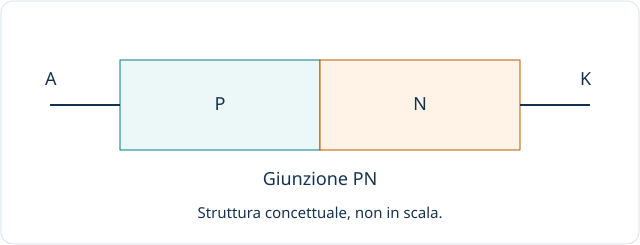
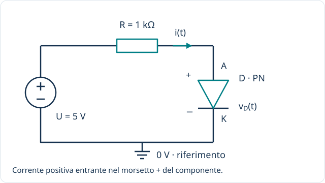

[← Componenti](index.qmd) · [Transistor →](transistor.qmd)

**Idea guida:** il diodo è un componente a due terminali con un comportamento diverso a seconda della polarità della tensione applicata. È un componente **non lineare**: una resistenza costante non basta a descriverlo.

## 1 / Struttura e terminali

Partiamo dal diodo a **giunzione PN**: due regioni di semiconduttore, una di tipo P e una di tipo N, formano una giunzione. Il drogaggio modifica la concentrazione dei portatori: nella regione P prevalgono le lacune, in quella N gli elettroni. Le regioni nel loro insieme non sono semplicemente due blocchi carichi positivamente e negativamente.

Vicino alla giunzione si forma una zona povera di portatori mobili, detta *regione di svuotamento*, con un campo elettrico interno. La tensione applicata modifica questa barriera e quindi la facilità con cui passa corrente.

I terminali sono **anodo A** e **catodo K**. Nel simbolo elettrico, la barretta indica il catodo. Il riferimento di tensione è $v_D=v_A-v_K$; la corrente diretta positiva va da A verso K.

Non tutti i diodi sono PN: per esempio, il diodo Schottky usa una giunzione metallo-semiconduttore.

## 2 / Come funziona

### Polarizzazione diretta

Con l'anodo a potenziale maggiore del catodo, la barriera della giunzione PN si riduce e la corrente può crescere rapidamente. In un calcolo introduttivo si può approssimare la caduta di un diodo al silicio con $0{,}7\,\mathrm V$, ma **non è una soglia esatta né universale**: dipende da corrente, temperatura e dispositivo.

### Polarizzazione inversa

Con il catodo a potenziale maggiore dell'anodo, la corrente resta generalmente piccola finché non si raggiunge la regione di *breakdown*. Non equivale a isolamento perfetto. I diodi progettati per lavorare in breakdown, come gli Zener, richiedono comunque una limitazione della corrente.

## 3 / Un circuito semplice

Il resistore limita la corrente. Con il modello a caduta costante $V_D\simeq0{,}7\,\mathrm V$:

$$I\simeq\frac{5-0{,}7}{1000}\,\mathrm A=4{,}3\,\mathrm{mA}.$$

Questo è un esempio di calcolo, non una proprietà universale del diodo. Invertendo il generatore, il diodo si trova in polarizzazione inversa; entro i limiti del componente, la corrente sarà molto più piccola.

## 4 / Dove si usa

| Applicazione | Funzione del diodo |
|---|---|
| Raddrizzamento | Favorisce il passaggio della corrente nella direzione prevista, per ottenere una tensione unidirezionale da un'alternata. |
| Protezione dalle inversioni | In alcune configurazioni limita la corrente se si inverte l'alimentazione. |
| Ricircolo su carichi induttivi | Offre un percorso alla corrente di una bobina quando il comando viene disattivato. |
| Limitazione e riferimento | Diodi opportuni limitano escursioni di tensione o forniscono un riferimento approssimato. |
| Emissione e ricezione della luce | LED e fotodiodi collegano fenomeni elettrici e ottici. |

Un LED richiede una corrente controllata e ha una caduta diretta che dipende anche dal tipo e dal colore. Un raddrizzatore e un LED non sono sostituibili solo perché entrambi sono diodi.

## 5 / Che cosa guardare nel datasheet

Corrente ammissibile, tensione inversa massima, caduta diretta alle condizioni specificate, potenza e comportamento termico. Nelle commutazioni diventano importanti anche velocità, cariche e capacità interne.

Per ora ci fermiamo al funzionamento generale. Il passo successivo sarà leggere la curva corrente-tensione e scegliere un modello adatto al circuito.

**Verifica:** perché nell'esempio non si collega il diodo direttamente al generatore ideale da 5 V? Perché la corrente diretta non sarebbe adeguatamente limitata dal circuito.

[Toshiba — Funzionamento di un diodo](https://toshiba.semicon-storage.com/us/semiconductor/knowledge/faq/diode/how-do-diodes-work.html) · [Toshiba — Famiglie di diodi](https://toshiba.semicon-storage.com/ap-en/semiconductor/knowledge/faq/diode/what-are-diodes.html)
