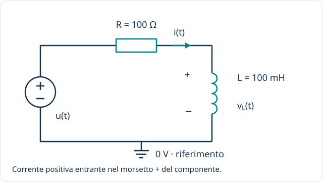

[← Componenti](index.qmd) · [Resistore](resistore.qmd) · [Condensatore](condensatore.qmd)

**Idea guida:** l'induttore immagazzina energia nel campo magnetico. Una tensione ai suoi capi fa variare la corrente; una corrente non nulla può esistere anche con tensione nulla.

::: {.callout-note}
## Come leggere questa pagina in terza
Studia prima osservazioni, calcoli elementari e variazioni su intervalli. Le sezioni con derivate, integrali, fasori e trasformate sono anticipazioni: saranno approfondite negli anni successivi e non sono prerequisiti per capire il comportamento di base.

[Richiami: rapidità di variazione, somma di contributi e strumenti matematici](../fondamenti/matematica-per-approfondire.qmd).
:::

## Livello 1 / Riconoscere il componente {#livello-1}

L'**induttanza** $L$ si misura in henry ($\mathrm H$). Useremo $L=100\,\mathrm{mH}=0{,}1\,\mathrm H$, in serie a un resistore $R=100\,\Omega$.

In questo circuito $u(t)=v_R(t)+v_L(t)$ e la corrente $i(t)$ è comune ai due componenti. Cambieremo l'alimentazione nei diversi livelli mantenendo lo stesso schema.

## Livello 2 / Regime continuo e valori istantanei {#livello-2}

### Flusso concatenato ed energia

Nel modello lineare il flusso magnetico concatenato $\lambda$ è proporzionale alla corrente:

$$\lambda=Li_L,\qquad W_L=\frac12 Li_L^2.$$

$\lambda$ tiene conto delle spire concatenate al flusso; si misura in weber-spira, equivalenti a volt-secondo. L'energia $W_L$ si misura in joule.

Con $L=0{,}1\,\mathrm H$ e $i_L=0{,}1\,\mathrm A$:

$$\lambda=0{,}01\,\mathrm{V\,s},\qquad W_L=0{,}5\,\mathrm{mJ}.$$

### A regime continuo

Se la corrente è costante, anche il flusso è costante e la tensione sull'induttore ideale è zero. **A regime continuo l'induttore ideale equivale a un cortocircuito.** Nel circuito disegnato con $u=10\,\mathrm V$, la corrente finale è quindi $10/100=0{,}1\,\mathrm A$.

È una proprietà del modello ideale: una bobina reale ha anche la resistenza del filo. Inoltre il regime non è sempre raggiungibile: senza R, una tensione continua non nulla su L ideale farebbe crescere la corrente senza limite.

### Valori istantanei {#la-fotografia-di-un-istante}

Nel circuito RL, se conosciamo $u(t_0)$ e $i(t_0)$:

$$v_L(t_0)=u(t_0)-Ri(t_0).$$

Con $u=10\,\mathrm V$ e $i=40\,\mathrm{mA}$, $v_L=6\,\mathrm V$. La sola corrente nell'induttore non determina la tensione: qui usiamo anche generatore e resistore.

## Livello 3 / Variazioni e transitorio senza derivate {#intervalli}

### Quanta corrente si aggiunge in un intervallo?

Per un'induttanza costante, con le polarità indicate nello schema:

$$\Delta I=\frac{V_{L,media}\Delta t}{L}.$$

La tensione media è quella ai capi del solo induttore, non automaticamente quella del generatore. Con tensione costante si usa direttamente quel valore; con tensione variabile, sostituire la media con il valore iniziale dà un'approssimazione.

Se ai capi di $L=100\,\mathrm{mH}$ rimane 1 V per 1 ms, la corrente aumenta di 10 mA. Nel circuito RL la tensione sull'induttore cambia durante il transitorio: il dato “1 V costante” descrive un intervallo con quella condizione, non l'intera accensione del circuito iniziale.

Nel circuito RL con generatore a 10 V, quando $i=40\,\mathrm{mA}$ la tensione su L è 6 V. Per i successivi $10\,\mathrm{\mu s}$, trattandola come costante, stimiamo $\Delta i\simeq0{,}6\,\mathrm{mA}$. La tensione reale su L diminuisce mentre la corrente cresce.

### Perché la corrente non cresce sempre allo stesso ritmo? {#transitorio-senza-derivate}

1. All'inizio, con corrente nulla, la caduta su R è nulla.
2. La tensione sull'induttore fa aumentare la corrente.
3. Aumenta quindi la caduta $Ri$ sul resistore.
4. Rimane meno tensione su L e la corrente cresce più lentamente.

La corrente finale tende a $U_0/R$. La costante di tempo è $\tau=L/R$: con 100 mH e 100 Ω vale 1 ms. Dopo una costante di tempo si è compiuto circa il 63,2% della variazione verso il valore finale.

La relazione completa può essere fornita senza richiederne la derivazione:

$$i(t)=\frac{U_0}{R}+\left(I_0-\frac{U_0}{R}\right)e^{-t/\tau}.$$

$I_0$ è la corrente iniziale. Allo spegnimento l'energia già presente richiede un percorso di scarica: osserva il [diodo di ricircolo](diodo.qmd#ricircolo).

### Sommare le variazioni di corrente {#accumulare-le-variazioni}

Somma le variazioni $\Delta I$ dei vari intervalli al valore iniziale. Il prodotto tensione media × durata è un'area nel grafico tensione–tempo. Il calcolo integrale formalizzerà questa somma negli anni successivi.

**Verifica.** A parità di tensione media e durata, raddoppiare L dimezza l'aumento di corrente. L'induttore si oppone alle variazioni di corrente, non alla corrente costante in sé.

## Livello 4 / Formalizzare: Dalle variazioni alla derivata {#livello-3}

**Anticipazione per gli anni successivi.** La derivata descrive la rapidità istantanea di variazione di una grandezza, cioè la pendenza del suo grafico nel tempo; l’integrale permette di sommare contributi distribuiti nel tempo. Qui introduciamo le relazioni formali, da approfondire dopo lo studio di questi strumenti.

### La velocità di variazione della corrente

Con $L$ costante e la convenzione dell'utilizzatore:

$$v_L(t)=\frac{d\lambda}{dt}=L\frac{di_L(t)}{dt}.$$

Il segno positivo dipende dai versi indicati nello schema. La forza elettromotrice indotta si oppone alla variazione del flusso; la tensione ai morsetti nella convenzione scelta è quella scritta sopra.

Su un intervallo:

$$v_{L,\mathrm{media}}=L\frac{\Delta i_L}{\Delta t}.$$

Se la corrente cresce linearmente di $20\,\mathrm{mA}$ in $1\,\mathrm{ms}$, con $L=0{,}1\,\mathrm H$ la tensione vale $2\,\mathrm V$ nell'intervallo.

La forma integrale è:

$$i_L(t)=i_L(t_0)+\frac1L\int_{t_0}^{t}v_L(\xi)\,d\xi.$$

Con tensione finita la corrente è continua: $i_L(0^+)=i_L(0^-)$. Un salto ideale richiederebbe un impulso di tensione. Il valore iniziale di corrente rappresenta la memoria dell'induttore.

### Il circuito RL: derivare l'equazione

Sostituendo $v_R=Ri$ e $v_L=L\,di/dt$ in $u=v_R+v_L$:

$$L\frac{di}{dt}+Ri=u(t).$$

Per un generatore che assume il valore costante $U_0$ da $t=0$, con corrente iniziale $I_0$:

$$i(t)=\frac{U_0}{R}+\left(I_0-\frac{U_0}{R}\right)e^{-t/\tau},\qquad \tau=\frac LR.$$

Con $U_0=10\,\mathrm V$, $I_0=0$, $R=100\,\Omega$, $L=0{,}1\,\mathrm H$:

$$\tau=1\,\mathrm{ms},\quad i(\tau)\simeq63{,}21\,\mathrm{mA},\quad v_L(\tau)\simeq3{,}679\,\mathrm V.$$

All'inizio la corrente è zero e tutta la tensione del generatore è ai capi di L. Durante la crescita della corrente aumenta la caduta su R; alla fine $v_L$ tende a zero.

## Livello 5A / Regime sinusoidale e fasori {#livello-4}

**Per gli anni successivi.** Un fasore raccoglie ampiezza e fase di una sinusoide; l’impedenza collega tensione e corrente alla stessa frequenza. Per ora osserva soprattutto se sono in fase o sfasate.

Se $i_L(t)=I_m\cos(\omega t)$, allora:

$$v_L(t)=-\omega LI_m\sin(\omega t)=\omega LI_m\cos(\omega t+\pi/2).$$

La tensione anticipa la corrente di $90^\circ$; equivalentemente, la corrente è in ritardo di $90^\circ$ rispetto alla tensione.

$$\underline V_L=j\omega L\underline I_L,\qquad Z_L(j\omega)=j\omega L.$$

Il modulo $|Z_L|=\omega L$ aumenta con la frequenza. Con $L=0{,}1\,\mathrm H$ e $f=50\,\mathrm{Hz}$, $|Z_L|\simeq31{,}42\,\Omega$.

Per il circuito completo occorre includere R:

$$\underline I=\frac{\underline U}{R+j\omega L}.$$

Con tensione del generatore di picco $10\,\mathrm V$ a $50\,\mathrm{Hz}$, la corrente di picco è circa $95{,}40\,\mathrm{mA}$ e ritarda di circa $17{,}44^\circ$. Il ritardo non è $90^\circ$, perché stiamo confrontando la corrente con la tensione dell'intero circuito, non con la sola $v_L$.

## Livello 5B / Serie e trasformata di Fourier: ogni armonica vede un'impedenza diversa {#livello-5}

**Per gli anni successivi.** La serie di Fourier rappresenta un segnale periodico mediante una componente continua e armoniche sinusoidali. La trasformata di Fourier descrive il contenuto in frequenza anche di segnali non periodici, quando applicabile. Nei circuiti lineari studiati qui possiamo calcolare separatamente la risposta a ciascuna armonica e sommare i risultati.

Per un generatore periodico:

$$u(t)=U_{\mathrm{DC}}+\sum_{n=1}^{\infty}A_n\cos(n\omega_0t+\varphi_n),$$

la corrente a regime nel circuito RL è:

$$i(t)=\frac{U_{\mathrm{DC}}}{R}+\sum_{n=1}^{\infty}\frac{A_n}{\sqrt{R^2+(n\omega_0L)^2}}\cos\!\left(n\omega_0t+\varphi_n-\arctan\frac{n\omega_0L}{R}\right).$$

A parità di ampiezza di tensione, le armoniche più alte producono meno corrente. Ma il comportamento dipende anche da **quale uscita scegliamo**:

$$\frac{\underline V_R}{\underline U}=\frac{R}{R+j\omega L},\qquad \frac{\underline V_L}{\underline U}=\frac{j\omega L}{R+j\omega L}.$$

[Apri lo schema a dimensione intera](/assets/fondamenti/rl-uscite.svg)

L'uscita su R è passa-basso; l'uscita su L è passa-alto. Entrambe hanno frequenza di taglio $f_c=R/(2\pi L)\simeq159{,}15\,\mathrm{Hz}$ per i valori dello schema.

Per segnali trasformabili, con le opportune condizioni sulla derivata:

$$\widehat V_L(\omega)=j\omega L\widehat I_L(\omega).$$

Per i segnali periodici abbiamo usato la serie di Fourier. Le [convenzioni comuni](index.qmd#fourier-e-laplace-una-distinzione-utile) chiariscono il rapporto con la trasformata e con il transitorio.

## Livello 5C / Trasformata di Laplace e condizioni iniziali {#livello-6}

**Per gli anni successivi.** La trasformata unilaterale di Laplace converte le equazioni differenziali dei circuiti lineari qui studiati in equazioni algebriche, includendo i termini dovuti alle condizioni iniziali. Le derivazioni seguenti sono un approfondimento facoltativo per la terza.

Con la trasformata unilaterale di Laplace da $0^-$ e $I_0=i_L(0^-)$:

$$V_L(s)=L\,[sI_L(s)-I_0]=sLI_L(s)-LI_0.$$

La sola impedenza $Z_L(s)=sL$ rappresenta il componente con **corrente iniziale nulla**. Se nell'induttore è già immagazzinata energia, occorre conservare anche il termine $-LI_0$.

Per il circuito RL:

$$L[sI(s)-I_0]+RI(s)=U(s),\qquad I(s)=\frac{U(s)+LI_0}{R+sL}.$$

Per un gradino $U(s)=U_0/s$ e $\tau=L/R$:

$$I(s)=\frac{U_0/R}{s}+\frac{I_0-U_0/R}{s+1/\tau}.$$

Antitrasformando i due termini:

$$i(t)=\frac{U_0}{R}+\left(I_0-\frac{U_0}{R}\right)e^{-t/\tau}\qquad(t\geq0).$$

Il polo è $s=-R/L<0$. A condizioni iniziali nulle, la funzione $I(s)/U(s)=1/(R+sL)$ ha unità di siemens: è una **transammettenza**, perché mette in rapporto una corrente e una tensione.

## Verifica e limiti del modello

1. Un induttore ideale mantiene una corrente costante di $0{,}1\,\mathrm A$: quanto vale la tensione ai suoi capi?
2. Nell'istante in cui $v_L=6\,\mathrm V$, con $L=0{,}1\,\mathrm H$, quanto vale $di/dt$?
3. Nel circuito disegnato, se $I_0=20\,\mathrm{mA}$ e $U_0=10\,\mathrm V$, quanto vale $i(\tau)$?

::: {.callout-tip collapse="true"}
## Soluzioni
1. Zero; l'energia magnetica può comunque essere non nulla.
2. $60\,\mathrm{A/s}$, cioè $60\,\mathrm{mA/ms}$.
3. $100-80e^{-1}\simeq70{,}57\,\mathrm{mA}$.
:::

Le bobine reali hanno resistenza, perdite, capacità parassite e possibili fenomeni di saturazione. L'induttanza costante è un'approssimazione valida entro un intervallo di funzionamento. L'interruzione rapida della corrente può produrre tensioni elevate: il modello serve anche a capire perché nei circuiti reali si prevedono percorsi di ricircolo e protezioni.

[Confronta con il condensatore](condensatore.qmd) · [Riferimenti](index.qmd#per-approfondire)

[Osserva il circuito della bobina con diodo di ricircolo](diodo.qmd#ricircolo): mostra il percorso della corrente quando il comando si apre.
