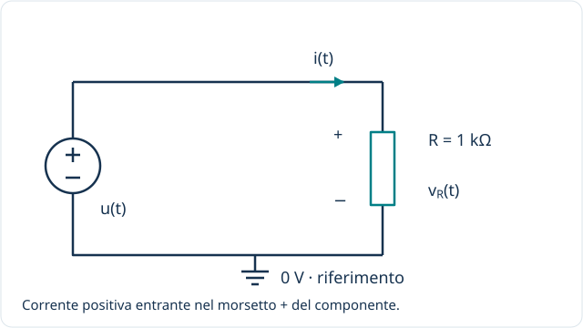

[← Componenti](index.qmd) · [Condensatore →](condensatore.qmd)

**Idea guida:** nel resistore ideale la corrente dipende dalla tensione dello stesso istante. Il componente dissipa energia e non ha uno stato elettrico da ricordare.

::: {.callout-note}
## Come leggere questa pagina in terza
Studia prima osservazioni, calcoli elementari e variazioni su intervalli. Le sezioni con derivate, integrali, fasori e trasformate sono anticipazioni: saranno approfondite negli anni successivi e non sono prerequisiti per capire il comportamento di base.

[Richiami: rapidità di variazione, somma di contributi e strumenti matematici](../fondamenti/matematica-per-approfondire.qmd).
:::

## Livello 1 / Riconoscere il componente {#livello-1}

Il **resistore** è il componente; la **resistenza** $R$ è la grandezza che ne descrive il comportamento, misurata in ohm ($\Omega$). Nel linguaggio comune si usa spesso “resistenza” anche per indicare il componente.

Useremo questo circuito in tutti gli esempi: il generatore impone $u(t)$ e, essendo collegato direttamente al resistore, $v_R(t)=u(t)$. Il valore di riferimento è $R=1\,\mathrm{k\Omega}$.

## Livello 2 / Regime continuo e valori istantanei {#livello-2}

### La legge di Ohm

Per il modello lineare a resistenza costante:

$$v_R=Ri_R,\qquad i_R=\frac{v_R}{R}.$$

Con una tensione continua di $5\,\mathrm V$:

$$i_R=\frac{5\,\mathrm V}{1000\,\Omega}=0{,}005\,\mathrm A=5\,\mathrm{mA}.$$

Raddoppiando la tensione a parità di $R$, raddoppia la corrente. Questo legame vale anche in un singolo istante di un segnale variabile: conoscere $v_R(t_0)$ basta per calcolare $i_R(t_0)$.

### Potenza ed energia

$$p_R(t)=v_R(t)i_R(t)=Ri_R^2(t)=\frac{v_R^2(t)}{R}\geq0.$$

Nell'esempio $P=25\,\mathrm{mW}$. Se questa potenza rimane costante per $10\,\mathrm s$, l'energia assorbita è $E=P\Delta t=0{,}25\,\mathrm J$. Il modello converte l'energia elettrica in calore: non la conserva per restituirla al circuito.

**Domanda:** a resistenza costante, raddoppiare la tensione raddoppia anche la potenza?

## Livello 3 / Variazioni senza derivate {#intervalli}

Con $R$ costante, la legge di Ohm vale in ogni istante. Se la tensione passa da 1 a 3 V su 1 kΩ, la corrente passa da 1 a 3 mA. Il rapporto fra le variazioni è:

$$\Delta I=\frac{\Delta V}{R}.$$

Se il cambiamento avviene linearmente in 2 ms, la pendenza della tensione è $2\,\mathrm V/2\,\mathrm{ms}=1\,\mathrm{V/ms}$, quella della corrente $1\,\mathrm{mA/ms}$. Non serve ancora una derivata per confrontare due punti.

### Un transitorio proprio? {#transitorio-senza-derivate}

Nel modello con solo generatore ideale e resistore la corrente segue direttamente la tensione: il resistore non deve caricarsi né accumula uno stato elettrico. Se il generatore varia gradualmente, varia gradualmente anche la corrente. Eventuali ritardi reali richiedono altri elementi del modello.

Per calcolare energia con potenza diversa in più intervalli, somma i prodotti potenza media × durata. Questa somma di contributi prepara al calcolo integrale: determina l’energia complessivamente dissipata, non energia immagazzinata nel resistore.

## Livello 4 / Formalizzare: Segnali variabili e derivate {#livello-3}

**Anticipazione per gli anni successivi.** La derivata descrive la rapidità istantanea di variazione di una grandezza, cioè la pendenza del suo grafico nel tempo; l’integrale permette di sommare contributi distribuiti nel tempo. Qui introduciamo le relazioni formali, da approfondire dopo lo studio di questi strumenti.

### Una relazione istantanea

$$i_R(t)=\frac{u(t)}{R}.$$

Se il generatore passa idealmente da $0$ a $5\,\mathrm V$, la corrente passa da $0$ a $5\,\mathrm{mA}$ senza un transitorio proprio del resistore. Eventuali ritardi del circuito reale dipendono da altri effetti, come capacità e induttanze parassite.

Se la tensione cresce linearmente da $0$ a $5\,\mathrm V$ in $2\,\mathrm{ms}$, la corrente cresce linearmente da $0$ a $5\,\mathrm{mA}$ nello stesso intervallo.

### Che cosa dice la derivata?

Per $R$ costante, negli intervalli in cui i segnali sono derivabili:

$$\frac{di_R}{dt}=\frac{1}{R}\frac{dv_R}{dt}.$$

La derivata esprime la pendenza. Nell'esempio:

$$\frac{dv_R}{dt}=2500\,\mathrm{V/s},\qquad \frac{di_R}{dt}=2{,}5\,\mathrm{A/s}.$$

Questa equazione si ottiene derivando la legge di Ohm: **non introduce memoria**. Il resistore non richiede una condizione iniziale indipendente e non ha una propria costante di tempo.

Per una potenza variabile, l'energia assorbita fra due istanti è:

$$E=\int_{t_a}^{t_b}p_R(t)\,dt.$$

## Livello 5A / Regime sinusoidale e fasori {#livello-4}

**Per gli anni successivi.** Un fasore raccoglie ampiezza e fase di una sinusoide; l’impedenza collega tensione e corrente alla stessa frequenza. Per ora osserva soprattutto se sono in fase o sfasate.

Poniamo $u(t)=V_m\cos(\omega t+\varphi)$. Allora:

$$i_R(t)=\frac{V_m}{R}\cos(\omega t+\varphi).$$

Tensione e corrente sono **in fase**: raggiungono massimi e zeri negli stessi istanti. Il fasore raccoglie ampiezza e fase; qui usiamo ampiezze di picco:

$$\underline V_R=R\underline I_R,\qquad Z_R=R.$$

Con $V_m=5\,\mathrm V$ e $R=1\,\mathrm{k\Omega}$, $I_m=5\,\mathrm{mA}$. I valori efficaci sono quelli di picco divisi per $\sqrt2$. La potenza media è:

$$P=\frac{V_{\mathrm{eff}}^2}{R}=\frac{V_m^2}{2R}=12{,}5\,\mathrm{mW}.$$

Non confondere questa sinusoide di picco $5\,\mathrm V$ con la tensione continua di $5\,\mathrm V$ del livello 2.

## Livello 5B / Serie e trasformata di Fourier: più frequenze insieme {#livello-5}

**Per gli anni successivi.** La serie di Fourier rappresenta un segnale periodico mediante una componente continua e armoniche sinusoidali. La trasformata di Fourier descrive il contenuto in frequenza anche di segnali non periodici, quando applicabile. Nei circuiti lineari studiati qui possiamo calcolare separatamente la risposta a ciascuna armonica e sommare i risultati.

Nel medesimo circuito scegliamo:

$$u(t)=2\,\mathrm V+(1\,\mathrm V)\cos(\omega_0t)+(0{,}5\,\mathrm V)\cos(3\omega_0t).$$

La corrente è la somma delle risposte ai tre termini:

$$i_R(t)=2\,\mathrm{mA}+(1\,\mathrm{mA})\cos(\omega_0t)+(0{,}5\,\mathrm{mA})\cos(3\omega_0t).$$

Ogni armonica viene scalata dello stesso fattore $1/R$, senza sfasamento. Il resistore ideale isolato **non seleziona le frequenze**; può contribuire a un filtro quando è collegato a condensatori o induttori.

Adottiamo la convenzione:

$$\widehat X(\omega)=\int_{-\infty}^{+\infty}x(t)e^{-j\omega t}\,dt.$$

Per segnali trasformabili, la linearità dà:

$$\widehat V_R(\omega)=R\widehat I_R(\omega).$$

Per segnali periodici persistenti come quello dell'esempio si usa direttamente la **serie di Fourier**; la trasformata con righe spettrali richiede le distribuzioni. Non serve introdurle per calcolare le singole armoniche.

## Livello 5C / Trasformata di Laplace e confronto con i componenti con memoria {#livello-6}

**Per gli anni successivi.** La trasformata unilaterale di Laplace converte le equazioni differenziali dei circuiti lineari qui studiati in equazioni algebriche, includendo i termini dovuti alle condizioni iniziali. Le derivazioni seguenti sono un approfondimento facoltativo per la terza.

Con la trasformata unilaterale di Laplace, definita da $0^-$ in avanti:

$$V_R(s)=RI_R(s),\qquad Z_R(s)=R.$$

Non compare un termine di energia iniziale. Per un gradino di ampiezza $U_0$ applicato a $t=0$, $U(s)=U_0/s$ e:

$$I_R(s)=\frac{U_0}{Rs}\quad\Longrightarrow\quad i_R(t)=\frac{U_0}{R}\quad(t>0).$$

La trasformata descrive lo stesso salto già trovato con Ohm. Nei circuiti [RC](condensatore.qmd#livello-6) e [RL](induttore.qmd#livello-6), invece, il resistore determina insieme a $C$ o $L$ la velocità con cui si esaurisce il transitorio.

## Verifica e limiti del modello

1. Quanto vale la corrente con $R=1\,\mathrm{k\Omega}$ e $v_R=3\,\mathrm V$?
2. Se la tensione continua raddoppia, di quanto varia la potenza?
3. Un resistore ideale alimentato da una sinusoide introduce sfasamento?

::: {.callout-tip collapse="true"}
## Soluzioni
1. $3\,\mathrm{mA}$.
2. Diventa quattro volte maggiore.
3. No: tensione e corrente sono in fase.
:::

Un resistore reale ha tolleranza, limiti di potenza, dipendenza dalla temperatura e comportamenti parassiti. Il modello $R$ costante è valido entro un intervallo di condizioni operative.

[Sperimenta nel circuito RC](../../laboratori/rc.qmd) · [Riferimenti e convenzioni](index.qmd#convenzioni-comuni)
