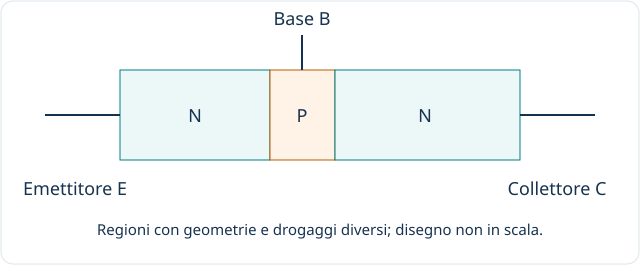
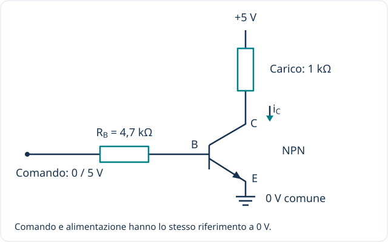

[← Componenti](index.qmd) · [Diodo](diodo.qmd)

**Idea guida:** un transistor permette a un segnale di comando di controllare una corrente. Può essere usato per amplificare segnali oppure come interruttore elettronico. L'energia fornita al carico proviene dall'alimentazione, non viene creata dal transistor.

## 1 / Due famiglie da distinguere

| Famiglia | Terminali | Descrizione introduttiva |
|---|---|---|
| **BJT**, transistor bipolare | Base B, collettore C, emettitore E | La polarizzazione della giunzione base-emettitore e una corrente di base consentono il controllo della corrente di collettore. |
| **MOSFET**, transistor a effetto di campo | Gate G, drain D, source S | La tensione fra gate e source controlla la conduzione del canale. Il gate è isolato dal semiconduttore. |

Il MOSFET possiede anche il terminale di corpo (*body*), spesso collegato internamente al source nei componenti discreti. Questa pagina introduce i dispositivi più comuni, senza descriverne ogni variante.

## 2 / Struttura e funzionamento del BJT

Un BJT contiene tre regioni semiconduttrici: **NPN** oppure **PNP**. La base è sottile; la struttura e il drogaggio di emettitore e collettore sono progettati per funzioni differenti. Non basta collegare due diodi esterni per ottenere un transistor.

Nel funzionamento amplificante di un NPN, la giunzione base-emettitore è polarizzata direttamente e quella base-collettore inversamente. Gran parte dei portatori iniettati dall'emettitore attraversa la base e raggiunge il collettore.

Una relazione introduttiva, valida nella regione attiva, è:

$$I_C\simeq\beta I_B.$$

$\beta$ non è una costante universale: cambia fra componenti e con le condizioni operative. La relazione non va applicata automaticamente quando il transistor è usato come interruttore in saturazione.

## 3 / Un esempio: NPN come interruttore

- **Comando basso:** con base ed emettitore circa allo stesso potenziale, il transistor è interdetto e nel carico scorre solo una corrente trascurabile nel modello introduttivo.
- **Comando alto:** il resistore di base limita la corrente di comando. Se il pilotaggio è adeguato al dispositivo e al carico, il BJT entra in saturazione e conduce.
- **Stato acceso:** la tensione collettore-emettitore è piccola ma non nulla; la corrente di carico dipende dall'alimentazione, dal carico e dalla caduta sul transistor.

I valori nello schema sono didattici. Un progetto reale richiede la verifica delle correnti, della saturazione e della potenza sul datasheet. Con un carico induttivo occorre anche gestire l'energia immagazzinata quando il transistor si spegne.

## 4 / Come cambia il MOSFET

Nel MOSFET ad arricchimento a canale N, un'adeguata tensione positiva $V_{GS}$ crea un canale conduttivo fra source e drain. Un gate isolato assorbe una corrente continua molto piccola, ma **deve essere caricato e scaricato durante la commutazione**: il circuito di pilotaggio deve fornire tali correnti.

[Apri lo schema a dimensione intera](/assets/fondamenti/mosfet.svg)

RG limita e smorza le correnti impulsive di pilotaggio; RGS mantiene il gate riferito al source in assenza del comando. I valori dipendono dal dispositivo, dal pilotaggio e dalla velocità richiesta.

La corrente continua del gate è piccola, ma durante le commutazioni si devono caricare e scaricare le capacità interne. Nel disegno sono semplificati il simbolo e il collegamento del body; il diodo interno non sostituisce automaticamente una protezione esterna del carico.

La tensione di soglia $V_{GS(th)}$ indica l'inizio della conduzione nelle condizioni di prova, non la tensione necessaria per pilotare qualunque carico con bassa resistenza. Si controlla la resistenza di conduzione $R_{DS(on)}$ alla tensione di gate effettivamente disponibile.

La parola **saturazione** ha significati diversi: nel BJT è tipicamente lo stato acceso usato come interruttore; nel MOSFET l'interruttore ben acceso lavora normalmente nella regione ohmica, mentre la regione di saturazione è usata anche per amplificare.

## 5 / Applicazioni

| Applicazione | Ruolo del transistor |
|---|---|
| Pilotaggio di LED, relè e motori | Permette a un segnale di comando di controllare un carico, entro i limiti del componente. |
| Amplificatori | Variazioni piccole del segnale di ingresso controllano variazioni del segnale di uscita, con energia fornita dall'alimentazione. |
| Circuiti logici e memoria | Reti di transistor realizzano porte e celle di memoria. |
| Alimentatori a commutazione | La commutazione controllata regola il trasferimento di energia. |
| Interfacce per sensori | Adatta o amplifica segnali in circuiti opportunamente progettati. |

## 6 / Che cosa verificare prima di usarlo

Tipo e piedinatura, tensioni e correnti ammissibili, potenza, condizioni termiche e area di funzionamento sicuro. Il contenitore o la sigla “NPN” non bastano a stabilire come collegarlo o quale carico possa pilotare.

**Verifica:** da dove proviene l'energia che un transistor amplificatore consegna al carico? Dall'alimentazione; il segnale di ingresso ne controlla il trasferimento.

[Toshiba — Introduzione a semiconduttori, BJT e MOSFET](https://toshiba.semicon-storage.com/us/semiconductor/knowledge/e-learning/discrete.html)

::: {.callout-note}
## Approfondimenti negli anni successivi
Caratteristiche complete, polarizzazione degli amplificatori, modelli per piccoli segnali e dimensionamento del pilotaggio saranno sviluppati in seguito. Per ora riconosci terminali, percorso della corrente di carico e ruolo del comando.
:::
